<p align="center">
  
</p>

<h1 align="center">Growth Equestre - Hackathon 2026</h1>

<p align="center">
  Plataforma de captação, qualificação e priorização de leads para os segmentos<br/>
  <strong>Eventos Equestres, Serviços Equestres, Cavalos e Equipamentos Equestres</strong>.
</p>

<p align="center">
  
  
  
  
  
</p>

---

<a id="indice"></a>

## Índice
- [1. Desafio do Hackathon](#1-desafio-do-hackathon)
- [2. Nossa Proposta de Solução](#2-nossa-proposta-de-solucao)
- [3. Arquitetura da Plataforma](#3-arquitetura-da-plataforma)
- [4. Tecnologias Utilizadas](#4-tecnologias-utilizadas)
- [5. Como Clonar e Rodar (Guia para Leigos)](#5-como-clonar-e-rodar-guia-para-leigos)
- [6. Como Clonar e Rodar (Guia para Experientes)](#6-como-clonar-e-rodar-guia-para-experientes)
- [7. Endereços e Health Checks](#7-enderecos-e-health-checks)
- [8. Como Usar as UIs na Prática](#8-como-usar-as-uis-na-pratica)
- [8.1 Fase 1 - UI Streamlit (MVP funcional)](#81-fase-1---ui-streamlit-mvp-funcional)
- [8.2 Fase 2 - UI Node.js + EJS (escalabilidade)](#82-fase-2---ui-nodejs--ejs-escalabilidade)
- [9. Como a Solução Apoia a Tomada de Decisão](#9-como-a-solucao-apoia-a-tomada-de-decisao)
- [10. Motor de Machine Learning (Dual Models)](#10-motor-de-machine-learning-dual-models)
- [11. Fluxo de Dados e Endpoints Principais](#11-fluxo-de-dados-e-endpoints-principais)
- [12. Estrutura de Pastas](#12-estrutura-de-pastas)
- [13. Troubleshooting](#13-troubleshooting)
- [14. Branches e Estratégia de Trabalho](#14-branches-e-estrategia-de-trabalho)
- [15. Documentação Complementar](#15-documentacao-complementar)

---

## 1. Desafio do Hackathon

[](#indice)
O desafio central foi responder, de forma prática e demonstrável:

> Como transformar um visitante casual em lead qualificado para produtos e serviços de alto valor no mercado equestre?

Problemas de negócio endereçados:
- captar sinais de intenção no funil;
- priorizar atendimento comercial;
- conectar lead com parceiro mais aderente por perfil e região;
- dar visibilidade operacional para times de Growth, Vendas e Data Science.

---

<a id="2-nossa-proposta-de-solucao"></a>

## 2. Nossa Proposta de Solução

[](#indice)
Construímos um sistema integrado com 2 interfaces (Node.js e Streamlit) sobre o mesmo backend e mesma base:

1. Captura e enriquecimento de leads.
2. Scoring explicável com ML (modelo campeão + runner-up).
3. CRM Kanban com status comerciais:
   `CURIOSO -> AQUECENDO -> QUALIFICADO -> ENVIADO`.
4. Matching automático de parceiros por UF/município/CNAE/segmento.
5. Operação assistida: handoff, edição, exclusão em lote, deduplicação, exportação CSV.

Resultado: o time consegue decidir com rapidez quem atender primeiro, para quem encaminhar e qual ação executar em seguida.

---

## 3. Arquitetura da Plataforma

[](#indice)
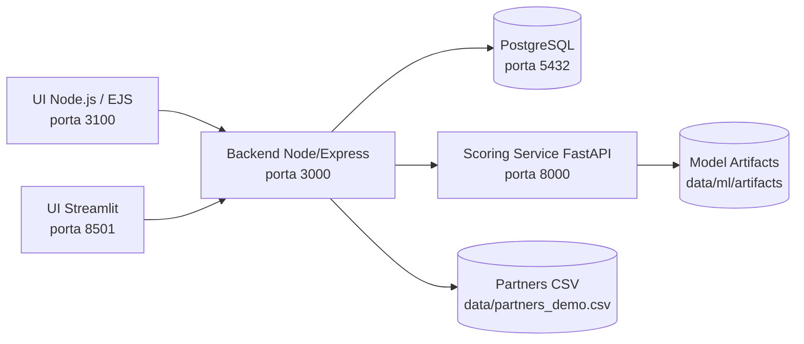

Princípio de arquitetura:
- ambas as UIs consomem os mesmos endpoints;
- regras de status e contagens foram sincronizadas entre telas;
- ML fica desacoplado em serviço dedicado para evolução independente.

---

## 4. Tecnologias Utilizadas

[](#indice)
| Camada | Stack |
|---|---|
| UI Web | Node.js, Express, EJS, JS vanilla |
| UI Admin | Streamlit |
| API | Node.js, Express, pg |
| Banco | PostgreSQL |
| Scoring | FastAPI, scikit-learn, joblib |
| Treino ML | Notebook + script Python (`GridSearchCV` + fine tuning) |
| Orquestração | Docker Compose |

---

## 5. Como Clonar e Rodar (Guia para Leigos)

[](#indice)
### 5.1 Pre-requisitos
Instale antes:
- Git
- Docker Desktop
- VS Code (recomendado)

### 5.2 Clonar o repositório
No terminal (PowerShell):
```powershell
git clone https://github.com/brodyandre/growth_equestre_hackathon_2026.git
cd growth_equestre_hackathon_2026
```

### 5.3 Configurar variáveis de ambiente
```powershell
Copy-Item .env.example .env
```

### 5.4 Subir tudo com Docker
```powershell
docker compose up -d --build
```

### 5.5 Validar se subiu corretamente
```powershell
(Invoke-WebRequest http://localhost:3000/health).StatusCode
(Invoke-WebRequest http://localhost:8000/health).StatusCode
(Invoke-WebRequest http://localhost:3100/health-ui).StatusCode
```

Se retornar `200`, está no ar.

### 5.6 Abrir as interfaces
- UI Node.js (principal): `http://localhost:3100`
- UI Streamlit (admin): `http://localhost:8501`

---

## 6. Como Clonar e Rodar (Guia para Experientes)

[](#indice)
```bash
git clone https://github.com/brodyandre/growth_equestre_hackathon_2026.git
cd growth_equestre_hackathon_2026
cp .env.example .env  # no PowerShell: Copy-Item .env.example .env
docker compose up -d --build
docker compose ps
```

Subir apenas um serviço:
```bash
docker compose up -d --build ui_web
docker compose up -d --build ui_admin
docker compose up -d --build backend scoring
```

Logs:
```bash
docker compose logs -f backend
docker compose logs -f ui_web
docker compose logs -f ui_admin
docker compose logs -f scoring
```

---

<a id="7-enderecos-e-health-checks"></a>

## 7. Endereços e Health Checks

[](#indice)
| Serviço | URL | Objetivo |
|---|---|---|
| Backend | `http://localhost:3000/health` | Saúde da API |
| Scoring | `http://localhost:8000/health` | Saúde e estado dos modelos |
| UI Node.js | `http://localhost:3100/health-ui` | Saúde da interface web |
| UI Node.js app | `http://localhost:3100` | Operação comercial |
| UI Streamlit app | `http://localhost:8501` | Operação/admin |

---

<a id="8-como-usar-as-uis-na-pratica"></a>

## 8. Como Usar as UIs na Prática

[](#indice)
As duas interfaces usam a mesma regra de negócio e os mesmos endpoints.

### 8.1 Fase 1 - UI Streamlit (MVP funcional)
Primeiro estruturamos o produto na Streamlit para validar rapidamente fluxo, dados e narrativa de pitch.

#### 8.1.1 Visão geral (Streamlit)
Painel inicial com volume de leads, distribuição por status, conversão e resumo comercial.

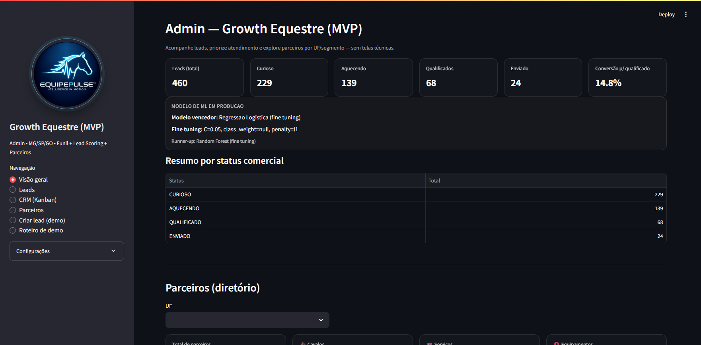

#### 8.1.2 Leads (Streamlit)
Tabela operacional para filtrar, acompanhar score/status e executar ações de atendimento.

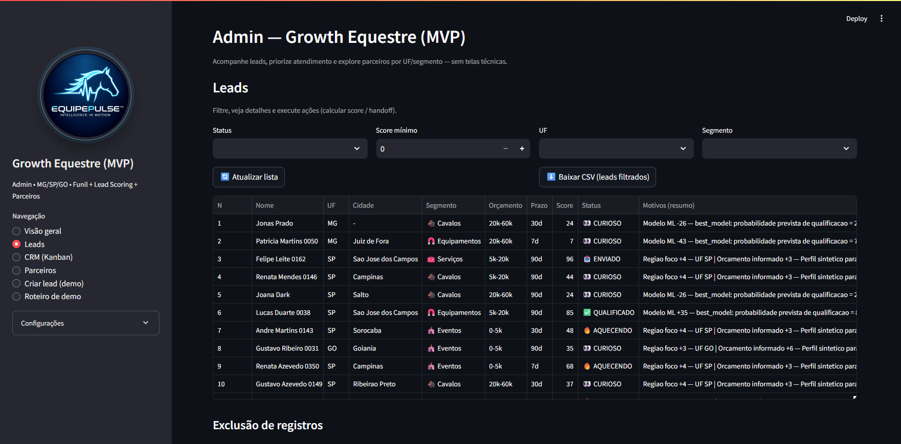

#### 8.1.3 CRM (Kanban) (Streamlit)
Board visual para priorizar atendimento e acompanhar o progresso por etapa.

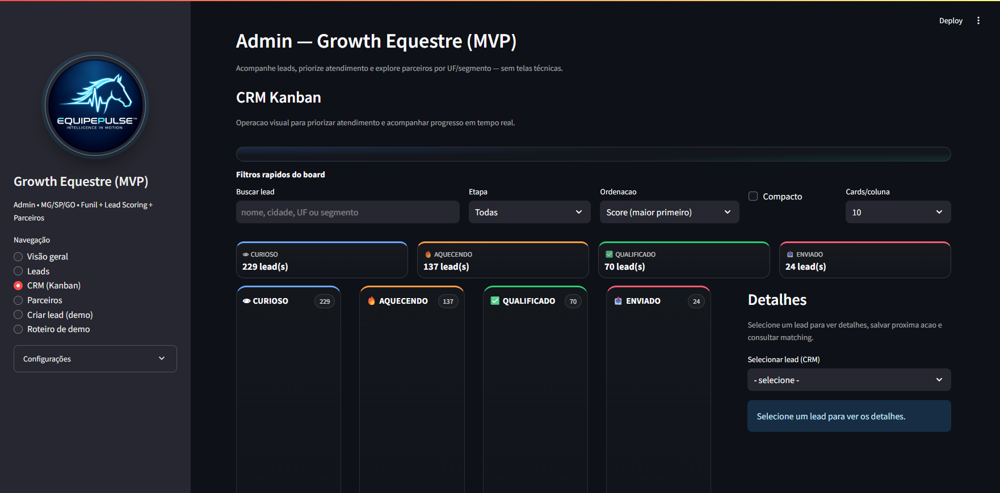

#### 8.1.4 Parceiros (Streamlit)
Diretório para busca por UF/segmento e exportação de lista de prospecção.

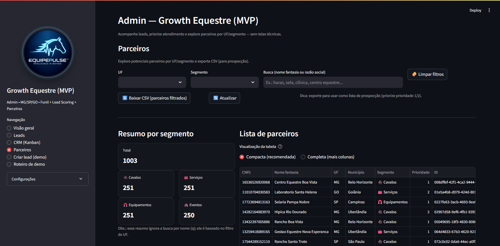

#### 8.1.5 Criar lead (demo) (Streamlit)
Formulário com atalhos por status para gerar cenários rapidamente e simular funil.

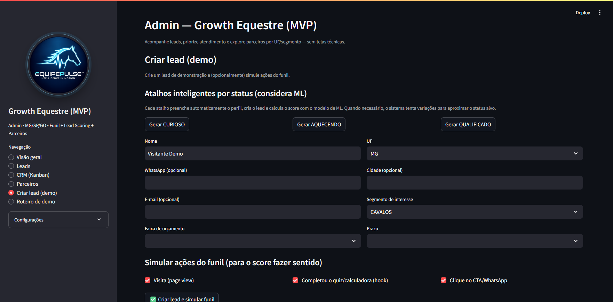

#### 8.1.6 Roteiro de demo (Streamlit)
Página guiada para pitch: cria cenário completo, mostra ordem recomendada e checklist de apresentação.

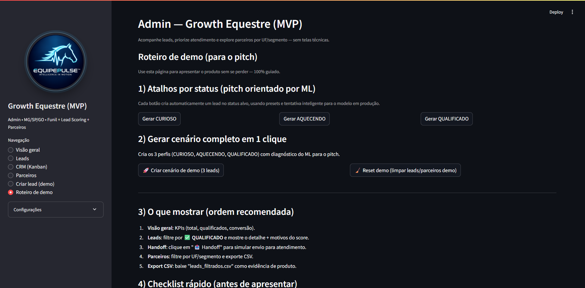

### 8.2 Fase 2 - UI Node.js + EJS (escalabilidade)
Com a Streamlit validada, migramos para Node.js + EJS para elevar escalabilidade de frontend, roteamento e evolução de produto com maior controle.

#### 8.2.1 Visão geral (Node.js)
KPIs executivos, conversão, resumo de status e modelo de ML em produção.

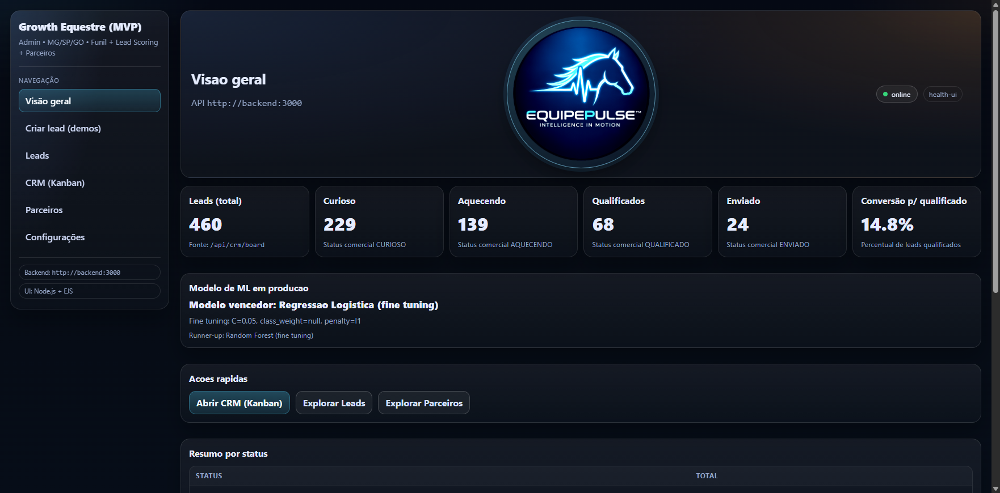

#### 8.2.2 Criar lead (demos) (Node.js)
Criação manual assistida e atalhos para CURIOSO/AQUECENDO/QUALIFICADO.

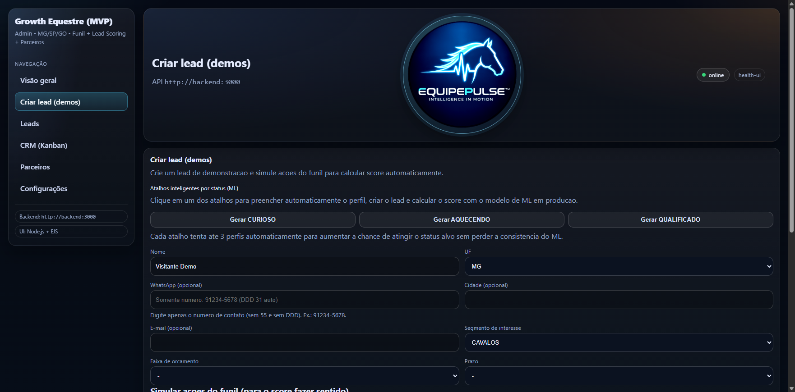

#### 8.2.3 Leads (Node.js)
Consulta rápida, filtros e ações de score, edição, exclusão e handoff.

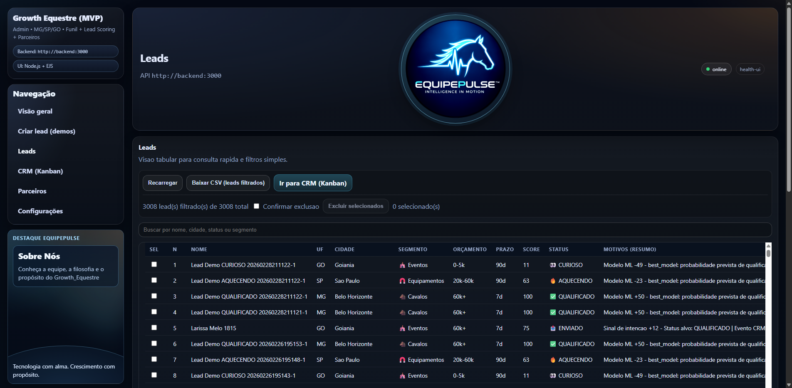

#### 8.2.4 CRM (Kanban) (Node.js)
Gestão por etapas (`CURIOSO`, `AQUECENDO`, `QUALIFICADO`, `ENVIADO`) com detalhes e próxima ação.

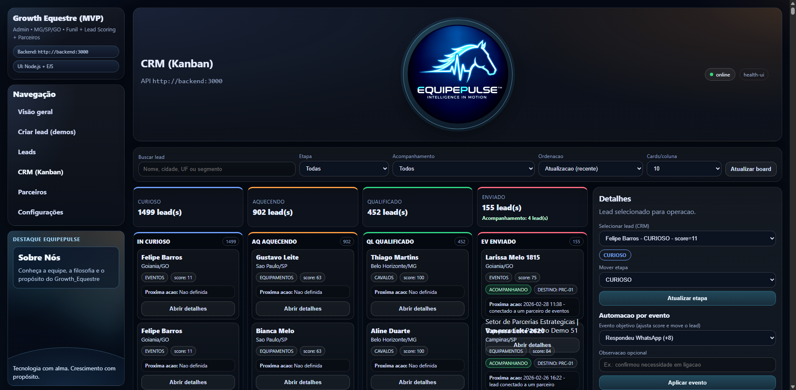

#### 8.2.5 Parceiros (Node.js)
Busca, filtros e consistência de dados para matching e exportação CSV.

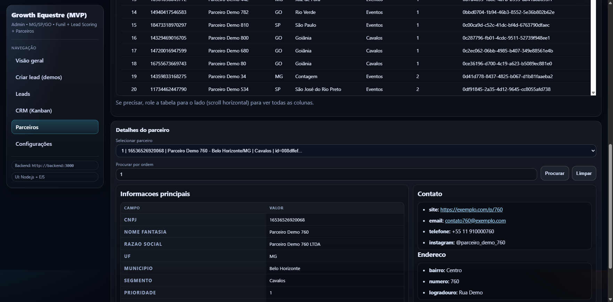

#### 8.2.6 Configurações (Node.js)
Parâmetros técnicos e manutenção operacional (incluindo deduplicação).

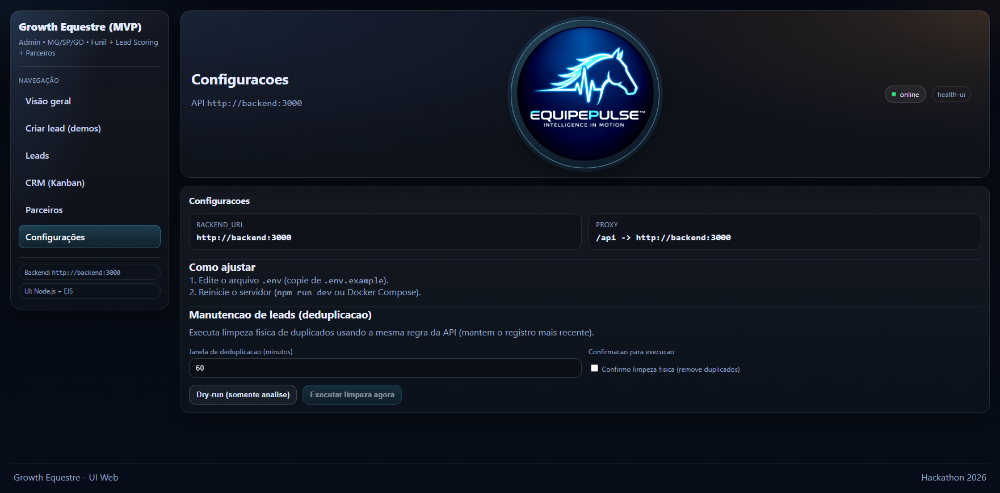

---

<a id="9-como-a-solucao-apoia-a-tomada-de-decisao"></a>

## 9. Como a Solução Apoia a Tomada de Decisão

[](#indice)
O sistema transforma dados operacionais em decisão comercial:

1. **Priorização de atendimento**
   - score e status indicam quem deve ser atendido primeiro.
2. **Risco de perda menor**
   - handoff marca lead `ENVIADO` quando está pronto para tratamento comercial.
3. **Aderência de oferta**
   - matching conecta lead ao parceiro mais alinhado por contexto.
4. **Visão executiva em tempo real**
   - KPIs consolidados na visão geral.
5. **Confiabilidade**
   - deduplicação e exclusão em lote evitam distorção operacional.

---

## 10. Motor de Machine Learning (Dual Models)

[](#indice)
### 10.1 Notebook principal
- `tools/ml/lead_scoring_caminho1_dual_models.ipynb`

### 10.2 Script de treino reprodutível
- `tools/ml/train_lead_scoring.py`

### 10.3 Modelos avaliados
- Regressão Logística (fine tuning)
- Random Forest (fine tuning)

### 10.4 Critério de desempate
Comparação por cascata:
1. ROC-AUC
2. PR-AUC
3. Brier score
4. Latência de inferência

### 10.5 Artefatos gerados
- `data/ml/artifacts/lead_scoring_best_model.joblib`
- `data/ml/artifacts/lead_scoring_runner_up_model.joblib`
- `data/ml/artifacts/model_selection_report.json`

### 10.6 Retreino rápido
```powershell
python tools/ml/train_lead_scoring.py --input-csv data/ml/lead_scoring_dataset.csv --output-dir data/ml/artifacts
```

Depois do retreino, reinicie o serviço de scoring:
```powershell
docker compose up -d --build scoring
```

---

## 11. Fluxo de Dados e Endpoints Principais

[](#indice)
| Endpoint | Método | Uso |
|---|---|---|
| `/leads` | `GET` | Lista leads |
| `/leads` | `POST` | Cria lead |
| `/leads/:id/score` | `POST` | Calcula score do lead |
| `/leads/delete` | `POST` | Exclusão em lote |
| `/crm/board` | `GET` | Dados do Kanban |
| `/crm/move` | `POST` | Move lead no Kanban |
| `/crm/leads/:id/matches` | `GET` | Matching de parceiros |
| `/partners` | `GET` | Lista parceiros |
| `/partners/summary` | `GET` | Resumo por segmento/UF |
| `/ml/model-info` | `GET` | Modelo vencedor e fine tuning |
| `/demo/seed-leads` | `POST` | Gera massa sintética (treino/demo) |
| `/demo/reset-seeded-leads` | `POST` | Remove apenas leads sintéticos |

---

## 12. Estrutura de Pastas

[](#indice)
```text
.
|- backend/                    # API Node/Express
|- scoring_service/            # FastAPI para score
|- ui_web/                     # UI Node.js + EJS
|- ui_admin/                   # UI Streamlit
|- tools/ml/                   # Notebook e scripts de treino
|- data/ml/                    # Dataset e artefatos ML
|- db/init.sql                 # Schema inicial Postgres
|- docs/                       # Materiais técnicos e planos
|- manuais_and_docs/           # Manuais finais para operação
|- docker-compose.yml          # Orquestração completa
|- start_and_validate.ps1      # Bootstrap + validação (Windows)
```

---

## 13. Troubleshooting

[](#indice)
### 13.1 Porta 3100 recusando conexão
```powershell
docker compose ps
docker compose logs ui_web --tail 100
```

### 13.2 Verificar se backend está no ar
```powershell
Invoke-WebRequest http://localhost:3000/health | Select-Object -ExpandProperty Content
```

### 13.3 Rebuild completo
```powershell
docker compose down
docker compose up -d --build
```

### 13.4 Ver portas ocupadas no Windows
```powershell
netstat -ano | findstr :3000
netstat -ano | findstr :3100
netstat -ano | findstr :8501
```

---

<a id="14-branches-e-estrategia-de-trabalho"></a>

## 14. Branches e Estratégia de Trabalho

[](#indice)
Convenção adotada:
- `feature/fe` -> entregas da UI Node.js
- `feature/be` -> entregas da UI Streamlit/operação admin
- `feature/ds` -> pipeline de dados e ML
- `main` -> consolidação estável

Recomendação:
- abrir PR separado por frente;
- revisar diff por domínio antes de merge.

---

<a id="15-documentacao-complementar"></a>

## 15. Documentação Complementar

[](#indice)
Materiais completos (PT-BR e Espanhol) em:
- `docs/resolução_desafio_growth_equestre/`
- `manuais_and_docs/`

Inclui:
- plano de resolução do desafio;
- guia de uso das interfaces;
- manual de setup no Windows/VS Code;
- documento técnico da solução de Data Science.

---

## Licença e Uso
Projeto acadêmico/hackathon com foco demonstrativo.

Se for evoluir para produção, recomenda-se:
- hardening de segurança;
- observabilidade centralizada;
- autenticação/autorização;
- governança de dados e LGPD.

