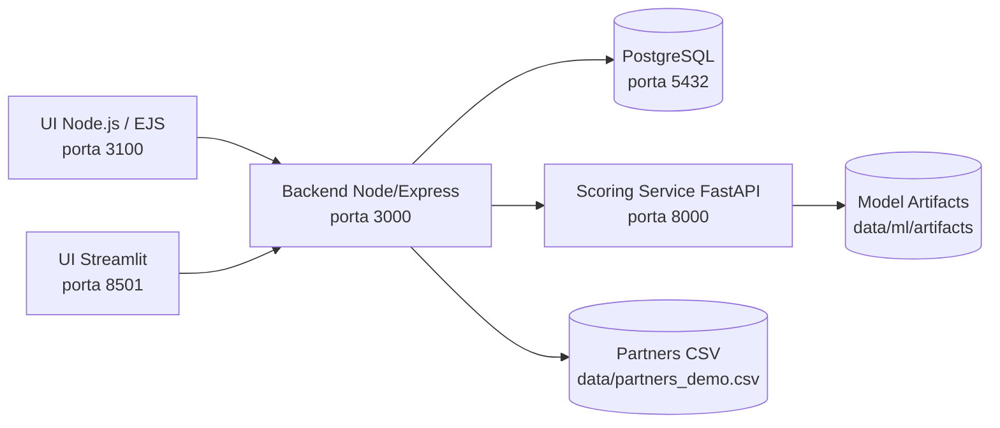

<p align="center">
  
</p>

<h1 align="center">Growth Equestre - Hackathon 2026</h1>

<p align="center">
  Plataforma de captacao, qualificacao e priorizacao de leads para os segmentos<br/>
  <strong>Eventos Equestres, Servicos Equestres, Cavalos e Equipamentos Equestres</strong>.
</p>

<p align="center">
  
  
  
  
  
</p>

---

## Indice
- [1. Desafio do Hackathon](#1-desafio-do-hackathon)
- [2. Nossa Proposta de Solucao](#2-nossa-proposta-de-solucao)
- [3. Arquitetura da Plataforma](#3-arquitetura-da-plataforma)
- [4. Tecnologias Utilizadas](#4-tecnologias-utilizadas)
- [5. Como Clonar e Rodar (Guia para Leigos)](#5-como-clonar-e-rodar-guia-para-leigos)
- [6. Como Clonar e Rodar (Guia para Experientes)](#6-como-clonar-e-rodar-guia-para-experientes)
- [7. Enderecos e Health Checks](#7-enderecos-e-health-checks)
- [8. Como Usar as UIs na Pratica](#8-como-usar-as-uis-na-pratica)
- [9. Como a Solucao Apoia a Tomada de Decisao](#9-como-a-solucao-apoia-a-tomada-de-decisao)
- [10. Motor de Machine Learning (Dual Models)](#10-motor-de-machine-learning-dual-models)
- [11. Fluxo de Dados e Endpoints Principais](#11-fluxo-de-dados-e-endpoints-principais)
- [12. Estrutura de Pastas](#12-estrutura-de-pastas)
- [13. Troubleshooting](#13-troubleshooting)
- [14. Branches e Estrategia de Trabalho](#14-branches-e-estrategia-de-trabalho)
- [15. Documentacao Complementar](#15-documentacao-complementar)

---


[](#indice)

O desafio central foi responder, de forma pratica e demonstravel:

> Como transformar um visitante casual em lead qualificado para produtos e servicos de alto valor no mercado equestre?

Problemas de negocio enderecados:
- captar sinais de intencao no funil;
- priorizar atendimento comercial;
- conectar lead com parceiro mais aderente por perfil e regiao;
- dar visibilidade operacional para times de Growth, Vendas e Data Science.

---


[](#indice)

Construimos um sistema integrado com 2 interfaces (Node.js e Streamlit) sobre o mesmo backend e mesma base:

1. Captura e enriquecimento de leads.
2. Scoring explicavel com ML (modelo campeao + runner-up).
3. CRM Kanban com status comerciais:
   `CURIOSO -> AQUECENDO -> QUALIFICADO -> ENVIADO`.
4. Matching automatico de parceiros por UF/municipio/CNAE/segmento.
5. Operacao assistida: handoff, edicao, exclusao em lote, deduplicacao, exportacao CSV.

Resultado: o time consegue decidir com rapidez quem atender primeiro, para quem encaminhar e qual acao executar em seguida.

---


[](#indice)



Principio de arquitetura:
- ambas as UIs consomem os mesmos endpoints;
- regras de status e contagens foram sincronizadas entre telas;
- ML fica desacoplado em servico dedicado para evolucao independente.

---


[](#indice)

| Camada | Stack |
|---|---|
| UI Web | Node.js, Express, EJS, JS vanilla |
| UI Admin | Streamlit |
| API | Node.js, Express, pg |
| Banco | PostgreSQL |
| Scoring | FastAPI, scikit-learn, joblib |
| Treino ML | Notebook + script Python (`GridSearchCV` + fine tuning) |
| Orquestracao | Docker Compose |

---


[](#indice)

### 5.1 Pre-requisitos
Instale antes:
- Git
- Docker Desktop
- VS Code (recomendado)

### 5.2 Clonar o repositorio
No terminal (PowerShell):
```powershell
git clone https://github.com/brodyandre/growth_equestre_hackathon_2026.git
cd growth_equestre_hackathon_2026
```

### 5.3 Configurar variaveis de ambiente
```powershell
Copy-Item .env.example .env
```

### 5.4 Subir tudo com Docker
```powershell
docker compose up -d --build
```

### 5.5 Validar se subiu corretamente
```powershell
(Invoke-WebRequest http://localhost:3000/health).StatusCode
(Invoke-WebRequest http://localhost:8000/health).StatusCode
(Invoke-WebRequest http://localhost:3100/health-ui).StatusCode
```

Se retornar `200`, esta no ar.

### 5.6 Abrir as interfaces
- UI Node.js (principal): `http://localhost:3100`
- UI Streamlit (admin): `http://localhost:8501`

---


[](#indice)

```bash
git clone https://github.com/brodyandre/growth_equestre_hackathon_2026.git
cd growth_equestre_hackathon_2026
cp .env.example .env  # no PowerShell: Copy-Item .env.example .env
docker compose up -d --build
docker compose ps
```

Subir apenas um servico:
```bash
docker compose up -d --build ui_web
docker compose up -d --build ui_admin
docker compose up -d --build backend scoring
```

Logs:
```bash
docker compose logs -f backend
docker compose logs -f ui_web
docker compose logs -f ui_admin
docker compose logs -f scoring
```

---


[](#indice)

| Servico | URL | Objetivo |
|---|---|---|
| Backend | `http://localhost:3000/health` | Saude da API |
| Scoring | `http://localhost:8000/health` | Saude e estado dos modelos |
| UI Node.js | `http://localhost:3100/health-ui` | Saude da interface web |
| UI Node.js app | `http://localhost:3100` | Operacao comercial |
| UI Streamlit app | `http://localhost:8501` | Operacao/admin |

---


[](#indice)

Ambas as UIs seguem a mesma logica de negocio.

### 8.1 Visao geral
- mostra total de leads e distribuicao por status;
- exibe conversao para qualificado;
- mostra modelo de ML em producao e parametros de fine tuning.

### 8.2 Criar lead (demos)
- formulario manual para criar lead;
- atalhos inteligentes:
  - `Gerar CURIOSO`
  - `Gerar AQUECENDO`
  - `Gerar QUALIFICADO`
- simulacao de eventos do funil (page view, hook, CTA/WhatsApp).

### 8.3 Leads
- tabela com numeracao (`N`) e selecao (`SEL`);
- filtros e busca rapida;
- acoes:
  - calcular/atualizar score;
  - editar lead;
  - excluir lead (individual ou em lote por checkbox);
  - handoff para `ENVIADO`.

### 8.4 CRM (Kanban)
- movimentacao visual entre colunas:
  - `CURIOSO`, `AQUECENDO`, `QUALIFICADO`, `ENVIADO`;
- ao selecionar lead, mostra matching de parceiros;
- controle de volume via slider de quantidade de matches;
- agendamento de proxima acao.

### 8.5 Parceiros
- listagem por UF, municipio, CNAE e segmento;
- consistencia de `Nome fantasia` sincronizada com tabela de parceiros;
- exportacao CSV para uso comercial.

---


[](#indice)

O sistema transforma dados operacionais em decisao comercial:

1. **Priorizacao de atendimento**
   - score e status indicam quem deve ser atendido primeiro.
2. **Risco de perda menor**
   - handoff marca lead `ENVIADO` quando esta pronto para tratamento comercial.
3. **Aderencia de oferta**
   - matching conecta lead ao parceiro mais alinhado por contexto.
4. **Visao executiva em tempo real**
   - KPIs consolidados na visao geral.
5. **Confiabilidade**
   - deduplicacao e exclusao em lote evitam distorcao operacional.

---


[](#indice)

### 10.1 Notebook principal
- `tools/ml/lead_scoring_caminho1_dual_models.ipynb`

### 10.2 Script de treino reprodutivel
- `tools/ml/train_lead_scoring.py`

### 10.3 Modelos avaliados
- Regressao Logistica (fine tuning)
- Random Forest (fine tuning)

### 10.4 Criterio de desempate
Comparacao por cascata:
1. ROC-AUC
2. PR-AUC
3. Brier score
4. Latencia de inferencia

### 10.5 Artefatos gerados
- `data/ml/artifacts/lead_scoring_best_model.joblib`
- `data/ml/artifacts/lead_scoring_runner_up_model.joblib`
- `data/ml/artifacts/model_selection_report.json`

### 10.6 Retreino rapido
```powershell
python tools/ml/train_lead_scoring.py --input-csv data/ml/lead_scoring_dataset.csv --output-dir data/ml/artifacts
```

Depois do retreino, reinicie o servico de scoring:
```powershell
docker compose up -d --build scoring
```

---


[](#indice)

| Endpoint | Metodo | Uso |
|---|---|---|
| `/leads` | `GET` | Lista leads |
| `/leads` | `POST` | Cria lead |
| `/leads/:id/score` | `POST` | Calcula score do lead |
| `/leads/delete` | `POST` | Exclusao em lote |
| `/crm/board` | `GET` | Dados do Kanban |
| `/crm/move` | `POST` | Move lead no Kanban |
| `/crm/leads/:id/matches` | `GET` | Matching de parceiros |
| `/partners` | `GET` | Lista parceiros |
| `/partners/summary` | `GET` | Resumo por segmento/UF |
| `/ml/model-info` | `GET` | Modelo vencedor e fine tuning |
| `/demo/seed-leads` | `POST` | Gera massa sintetica (treino/demo) |
| `/demo/reset-seeded-leads` | `POST` | Remove apenas leads sinteticos |

---


[](#indice)

```text
.
|- backend/                    # API Node/Express
|- scoring_service/            # FastAPI para score
|- ui_web/                     # UI Node.js + EJS
|- ui_admin/                   # UI Streamlit
|- tools/ml/                   # Notebook e scripts de treino
|- data/ml/                    # Dataset e artefatos ML
|- db/init.sql                 # Schema inicial Postgres
|- docs/                       # Materiais tecnicos e planos
|- manuais_and_docs/           # Manuais finais para operacao
|- docker-compose.yml          # Orquestracao completa
|- start_and_validate.ps1      # Bootstrap + validacao (Windows)
```

---


[](#indice)

### 13.1 Porta 3100 recusando conexao
```powershell
docker compose ps
docker compose logs ui_web --tail 100
```

### 13.2 Verificar se backend esta no ar
```powershell
Invoke-WebRequest http://localhost:3000/health | Select-Object -ExpandProperty Content
```

### 13.3 Rebuild completo
```powershell
docker compose down
docker compose up -d --build
```

### 13.4 Ver portas ocupadas no Windows
```powershell
netstat -ano | findstr :3000
netstat -ano | findstr :3100
netstat -ano | findstr :8501
```

---


[](#indice)

Convencao adotada:
- `feature/fe` -> entregas da UI Node.js
- `feature/be` -> entregas da UI Streamlit/operacao admin
- `feature/ds` -> pipeline de dados e ML
- `main` -> consolidacao estavel

Recomendacao:
- abrir PR separado por frente;
- revisar diff por dominio antes de merge.

---


[](#indice)

Materiais completos (PT-BR e Espanhol) em:
- `docs/resolução_desafio_growth_equestre/`
- `manuais_and_docs/`

Inclui:
- plano de resolucao do desafio;
- guia de uso das interfaces;
- manual de setup no Windows/VS Code;
- documento tecnico da solucao de Data Science.

---

## Licenca e Uso
Projeto academico/hackathon com foco demonstrativo.

Se for evoluir para producao, recomenda-se:
- hardening de seguranca;
- observabilidade centralizada;
- autenticacao/autorizacao;
- governanca de dados e LGPD.

