<p align="center">
  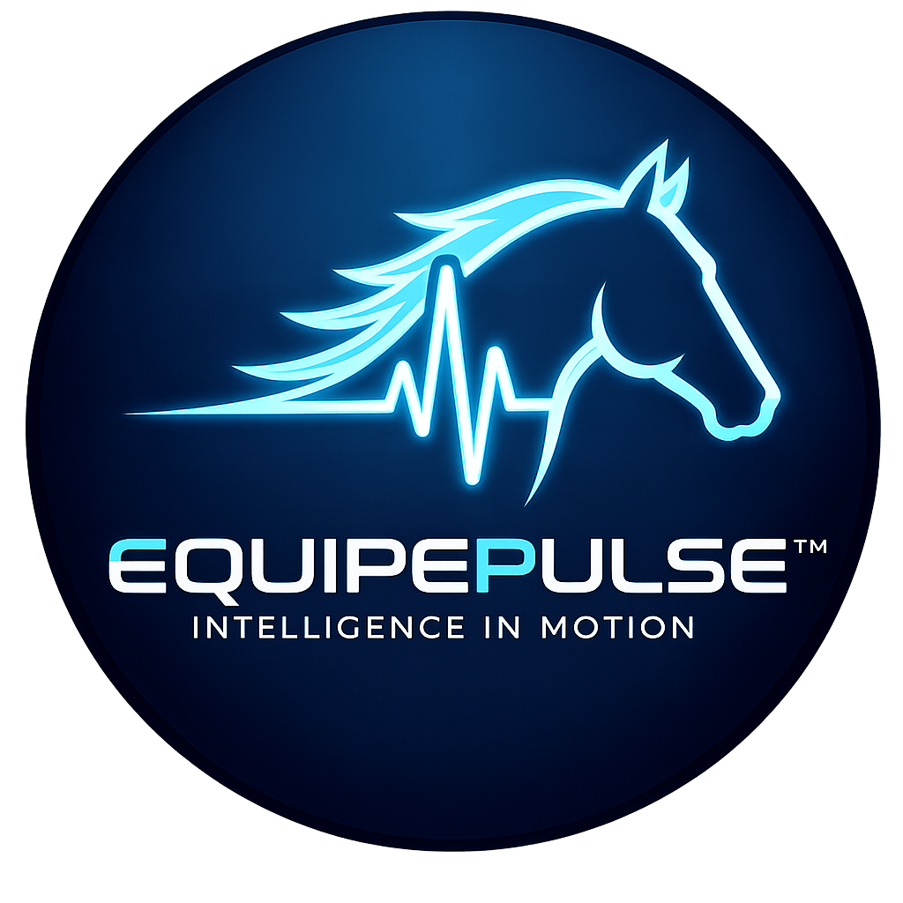
</p>

<h1 align="center">Growth Equestre - Hackathon 2026</h1>

<p align="center">
  Plataforma de captação, qualificação e priorização de leads para os segmentos<br/>
  <strong>Eventos Equestres, Serviços Equestres, Cavalos e Equipamentos Equestres</strong>.
</p>

<p align="center">
  
  
  
  
  
</p>

<p align="center">
  
</p>

---

<a id="indice"></a>

## Índice
- [1. Desafio do Hackathon](#1-desafio-do-hackathon)
- [2. Nossa Proposta de Solução](#2-nossa-proposta-de-solucao)
- [3. Arquitetura da Plataforma](#3-arquitetura-da-plataforma)
- [4. Tecnologias Utilizadas](#4-tecnologias-utilizadas)
- [5. Como Clonar e Rodar (Guia para Leigos)](#5-como-clonar-e-rodar-guia-para-leigos)
- [6. Como Clonar e Rodar (Guia para Experientes)](#6-como-clonar-e-rodar-guia-para-experientes)
- [7. Endereços e Health Checks](#7-enderecos-e-health-checks)
- [8. Como Usar as UIs na Prática](#8-como-usar-as-uis-na-pratica)
- [8.1 Fase 1 - UI Streamlit (MVP funcional)](#81-fase-1---ui-streamlit-mvp-funcional)
- [8.2 Fase 2 - UI Node.js + EJS (escalabilidade)](#82-fase-2---ui-nodejs--ejs-escalabilidade)
- [8.2.2 Guia detalhado - Criar lead (demos)](#822-guia-detalhado-criar-lead-demos)
- [8.2.2.1 Forma 1 - Atalhos Gerar CURIOSO/AQUECENDO/QUALIFICADO](#8221-forma-1--atalhos-gerar-curiosoaquecendoqualificado)
- [8.2.2.2 Forma 2 - Preenchimento manual + checklist do funil](#8222-forma-2--preenchimento-manual--checklist-do-funil)
- [8.2.2.3 Forma 3 - Roteiro de demo (pitch)](#8223-forma-3--roteiro-de-demo-pitch)
- [8.2.4 Guia detalhado - CRM (Kanban)](#824-guia-detalhado-crm-kanban)
- [8.2.6 Guia detalhado - Configurações](#826-guia-detalhado-configuracoes)
- [8.2.7 Guia detalhado - Sobre Nós](#827-guia-detalhado-sobre-nos)
- [9. Como a Solução Apoia a Tomada de Decisão](#9-como-a-solucao-apoia-a-tomada-de-decisao)
- [10. Motor de Machine Learning (Dual Models)](#10-motor-de-machine-learning-dual-models)
- [11. Fluxo de Dados e Endpoints Principais](#11-fluxo-de-dados-e-endpoints-principais)
- [12. Estrutura de Pastas](#12-estrutura-de-pastas)
- [13. Troubleshooting](#13-troubleshooting)
- [14. Branches e Estratégia de Trabalho](#14-branches-e-estrategia-de-trabalho)
- [15. Documentação Complementar](#15-documentacao-complementar)
- [16. 3 Questoes de LGPD (uso pratico na operacao)](#16-3-questoes-de-lgpd-uso-pratico-na-operacao)
- [17. Licença e Uso](#17-licenca-e-uso)
- [18. Colaboradores](#18-colaboradores)

---

## 1. Desafio do Hackathon

[](#indice)
O desafio central foi responder, de forma prática e demonstrável:

> Como transformar um visitante casual em lead qualificado para produtos e serviços de alto valor no mercado equestre?

Problemas de negócio endereçados:
- captar sinais de intenção no funil;
- priorizar atendimento comercial;
- conectar lead com parceiro mais aderente por perfil e região;
- dar visibilidade operacional para times de Growth, Vendas e Data Science.

---

<a id="2-nossa-proposta-de-solucao"></a>

## 2. Nossa Proposta de Solução

[](#indice)
Construímos um sistema integrado com 2 interfaces (Node.js e Streamlit) sobre o mesmo backend e mesma base:

1. Captura e enriquecimento de leads.
2. Scoring explicável com ML (modelo campeão + runner-up).
3. CRM Kanban com status comerciais:
   `CURIOSO -> AQUECENDO -> QUALIFICADO -> ENVIADO`.
4. Matching automático de parceiros por UF/município/CNAE/segmento.
5. Operação assistida: handoff, edição, exclusão em lote, deduplicação, exportação CSV.

Resultado: o time consegue decidir com rapidez quem atender primeiro, para quem encaminhar e qual ação executar em seguida.

---

## 3. Arquitetura da Plataforma

[](#indice)
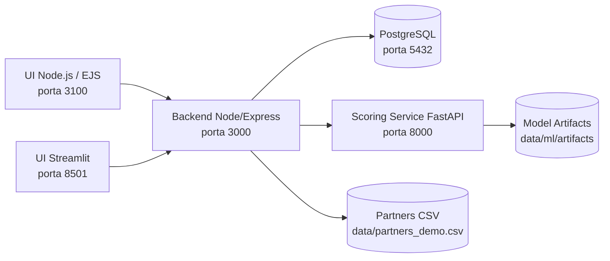
```mermaid
flowchart LR
    U1[UI Node.js / EJS<br/>porta 3100] --> B[Backend Node/Express<br/>porta 3000]
    U2[UI Streamlit<br/>porta 8501] --> B
    B --> DB[(PostgreSQL<br/>porta 5432)]
    B --> S[Scoring Service FastAPI<br/>porta 8000]
    S --> A[(Model Artifacts<br/>data/ml/artifacts)]
    B --> C[(Partners CSV<br/>data/partners_demo.csv)]
```

Princípio de arquitetura:
- ambas as UIs consomem os mesmos endpoints;
- regras de status e contagens foram sincronizadas entre telas;
- ML fica desacoplado em serviço dedicado para evolução independente.

---

## 4. Tecnologias Utilizadas

[](#indice)
| Camada | Stack |
|---|---|
| UI Web | Node.js, Express, EJS, JS vanilla |
| UI Admin | Streamlit |
| API | Node.js, Express, pg |
| Banco | PostgreSQL |
| Scoring | FastAPI, scikit-learn, joblib |
| Treino ML | Notebook + script Python (`GridSearchCV` + fine tuning) |
| Orquestração | Docker Compose |

---

## 5. Como Clonar e Rodar (Guia para Leigos)

[](#indice)
### 5.1 Pre-requisitos
Instale antes:
- Git
- Docker Desktop
- VS Code (recomendado)

### 5.2 Clonar o repositório
No terminal (PowerShell):
```powershell
git clone https://github.com/brodyandre/growth_equestre_hackathon_2026.git
cd growth_equestre_hackathon_2026
```

### 5.3 Configurar variáveis de ambiente
```powershell
Copy-Item .env.example .env
```

### 5.4 Subir tudo com Docker
```powershell
docker compose up -d --build
```

### 5.5 Validar se subiu corretamente
```powershell
(Invoke-WebRequest http://localhost:3000/health).StatusCode
(Invoke-WebRequest http://localhost:8000/health).StatusCode
(Invoke-WebRequest http://localhost:3100/health-ui).StatusCode
```

Se retornar `200`, está no ar.

### 5.6 Abrir as interfaces
- UI Node.js (principal): `http://localhost:3100`
- UI Streamlit (admin): `http://localhost:8501`

---

## 6. Como Clonar e Rodar (Guia para Experientes)

[](#indice)
```bash
git clone https://github.com/brodyandre/growth_equestre_hackathon_2026.git
cd growth_equestre_hackathon_2026
cp .env.example .env  # no PowerShell: Copy-Item .env.example .env
docker compose up -d --build
docker compose ps
```

Subir apenas um serviço:
```bash
docker compose up -d --build ui_web
docker compose up -d --build ui_admin
docker compose up -d --build backend scoring
```

Logs:
```bash
docker compose logs -f backend
docker compose logs -f ui_web
docker compose logs -f ui_admin
docker compose logs -f scoring
```

---

<a id="7-enderecos-e-health-checks"></a>

## 7. Endereços e Health Checks

[](#indice)
| Serviço | URL | Objetivo |
|---|---|---|
| Backend | `http://localhost:3000/health` | Saúde da API |
| Scoring | `http://localhost:8000/health` | Saúde e estado dos modelos |
| UI Node.js | `http://localhost:3100/health-ui` | Saúde da interface web |
| UI Node.js app | `http://localhost:3100` | Operação comercial |
| UI Streamlit app | `http://localhost:8501` | Operação/admin |

---

<a id="8-como-usar-as-uis-na-pratica"></a>

## 8. Como Usar as UIs na Prática

[](#indice)
As duas interfaces usam a mesma regra de negócio e os mesmos endpoints.

### 8.1 Fase 1 - UI Streamlit (MVP funcional)
Primeiro estruturamos o produto na Streamlit para validar rapidamente fluxo, dados e narrativa de pitch.

#### 8.1.1 Visão geral (Streamlit)
Painel inicial com volume de leads, distribuição por status, conversão e resumo comercial.

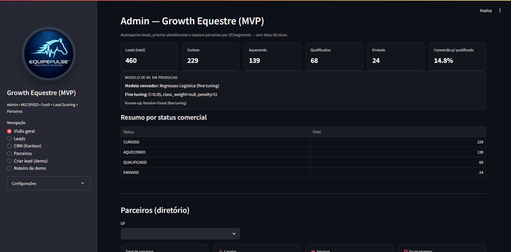

#### 8.1.2 Leads (Streamlit)
Tabela operacional para filtrar, acompanhar score/status e executar ações de atendimento.

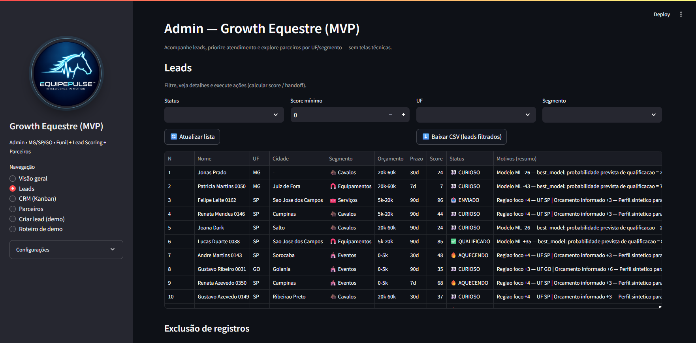

#### 8.1.3 CRM (Kanban) (Streamlit)
Board visual para priorizar atendimento e acompanhar o progresso por etapa.

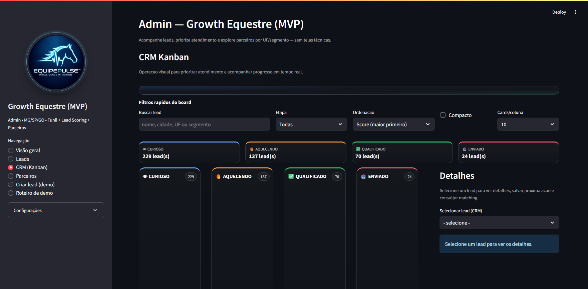

#### 8.1.4 Parceiros (Streamlit)
Diretório para busca por UF/segmento e exportação de lista de prospecção.

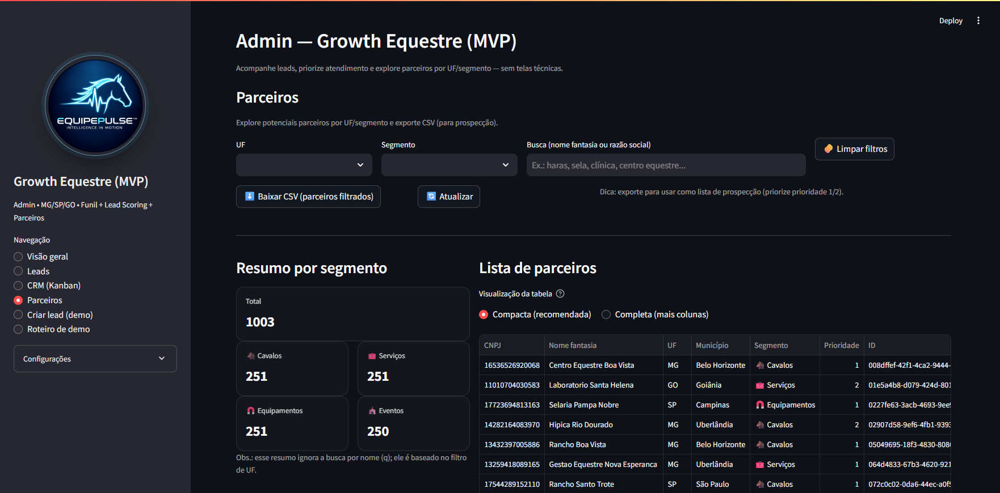

#### 8.1.5 Criar lead (demo) (Streamlit)
Formulário com atalhos por status para gerar cenários rapidamente e simular funil.

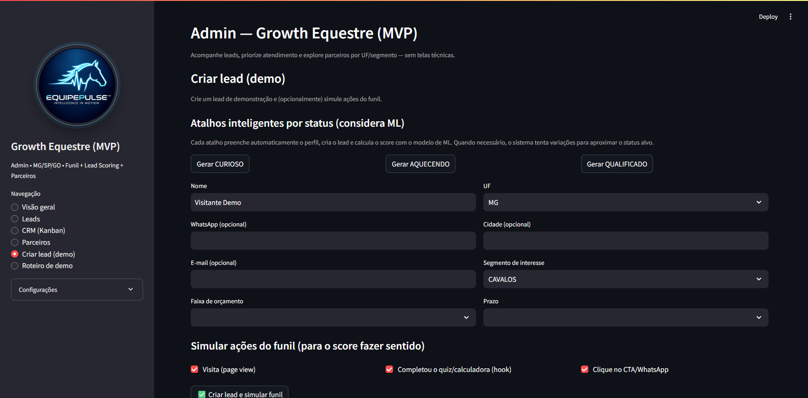

#### 8.1.6 Roteiro de demo (Streamlit)
Página guiada para pitch: cria cenário completo, mostra ordem recomendada e checklist de apresentação.

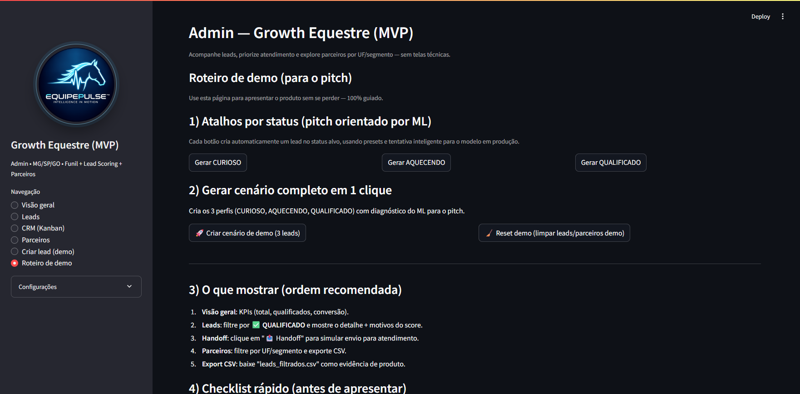

[](#indice)

### 8.2 Fase 2 - UI Node.js + EJS (escalabilidade)
Com a Streamlit validada, migramos para Node.js + EJS para elevar escalabilidade de frontend, roteamento e evolução de produto com maior controle.

#### 8.2.1 Visão geral (Node.js)
KPIs executivos, conversão, resumo de status e modelo de ML em produção.

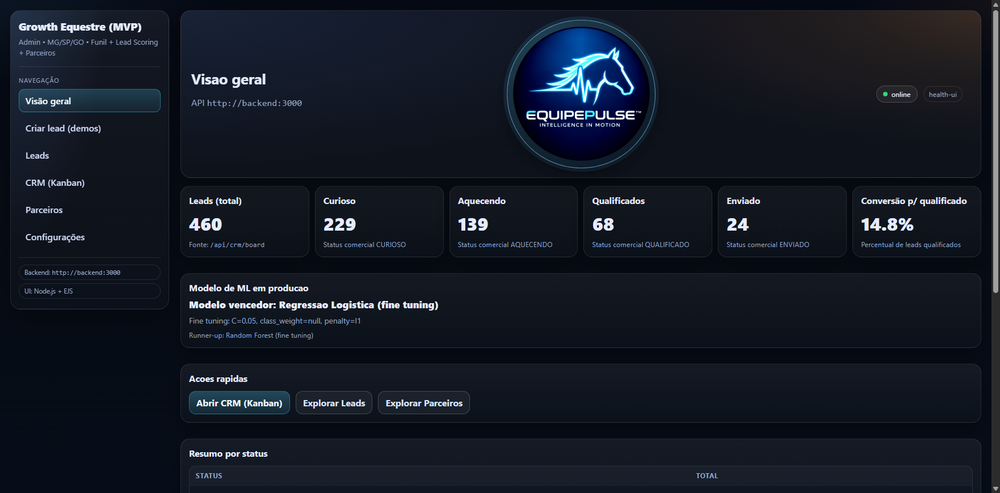

[](#indice)

<a id="822-guia-detalhado-criar-lead-demos"></a>

#### 8.2.2 Criar lead (demos) (Node.js) - guia detalhado
Esta guia oferece **3 formas de gerar leads** para operação e demonstração:
1. Pelos botões de atalho (`Gerar CURIOSO`, `Gerar AQUECENDO`, `Gerar QUALIFICADO`).
2. Pelo preenchimento manual dos campos + checklist do funil.
3. Pelo **Roteiro de demo (pitch)**, que cria 3 leads de uma vez.

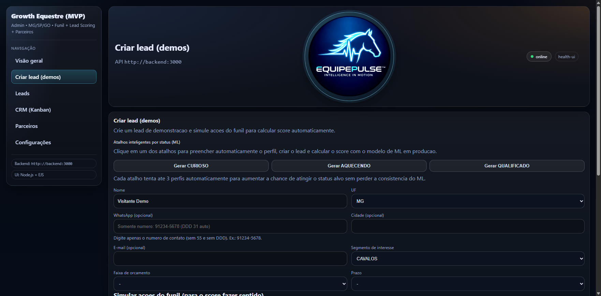

[](#indice)

##### Como decidir qual forma usar
| Forma | Quando usar | Resultado esperado |
|---|---|---|
| **Forma 1: atalhos** | Quando você quer gerar rapidamente um perfil-alvo. | Lead criado, score calculado e tentativa de atingir o status escolhido. |
| **Forma 2: manual** | Quando você quer simular um lead específico de negócio. | Score e motivos coerentes com os campos e eventos informados. |
| **Forma 3: roteiro de demo** | Quando precisa mostrar o funil completo no pitch. | Geração automática de `QUALIFICADO`, `AQUECENDO` e `CURIOSO`. |

<a id="8221-forma-1--atalhos-gerar-curiosoaquecendoqualificado"></a>

##### 8.2.2.1 Forma 1 - Atalhos Gerar CURIOSO/AQUECENDO/QUALIFICADO
Use os botões:
- `Gerar CURIOSO`
- `Gerar AQUECENDO`
- `Gerar QUALIFICADO`

Passo a passo:
1. Clique no botão do status desejado.
2. A UI testa automaticamente até 3 perfis para aproximar o resultado do status alvo.
3. Aguarde a mensagem de retorno e o card **Resultado**.

Como interpretar:
- Se aparecer `status alvo ... atingido`, o modelo confirmou o perfil esperado.
- Se aparecer `status previsto ... (alvo ...)`, houve variação natural do ML; o lead foi criado, mas em status diferente.
- O bloco **Diagnóstico de ML** mostra motor, modelo, probabilidade de qualificação e tentativa usada.

Exemplo real de retorno após atalho:

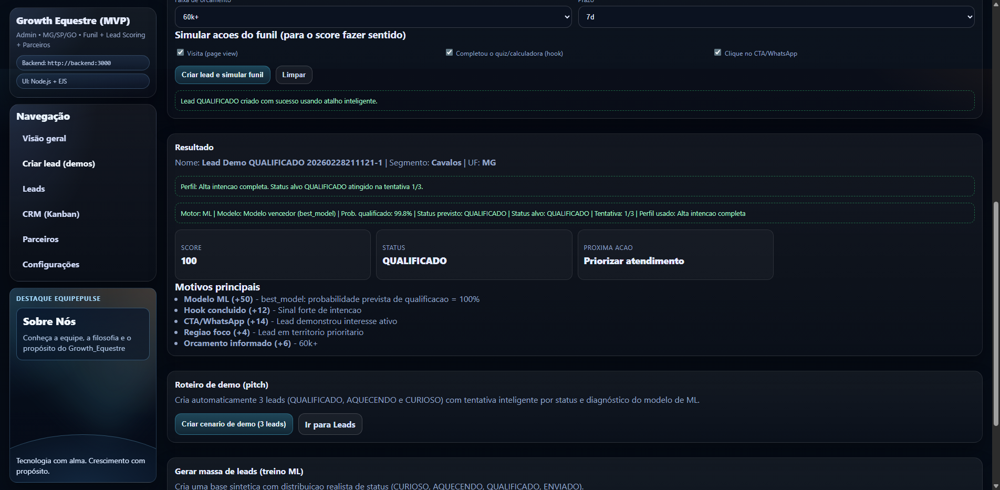

[](#indice)

<a id="8222-forma-2--preenchimento-manual--checklist-do-funil"></a>

##### 8.2.2.2 Forma 2 - Preenchimento manual + checklist do funil
Campos da guia e como preencher:

| Campo | Obrigatório | Como preencher | Impacto prático |
|---|---|---|---|
| `Nome` | Sim | Nome identificável do lead. | Base para rastreio e operação no CRM. |
| `UF` | Sim | Estado principal do lead. | Ajuda no matching e sinal regional do score. |
| `WhatsApp` | Não | Somente número local (sem `55` e sem DDD). | Canal comercial; pode influenciar leitura operacional. |
| `Cidade` | Não | Município do lead. | Melhora aderência regional com parceiros. |
| `E-mail` | Não | E-mail válido quando existir. | Canal alternativo de contato. |
| `Segmento de interesse` | Sim | `CAVALOS`, `SERVICOS`, `EVENTOS` ou `EQUIPAMENTOS`. | Sinal central de intenção comercial. |
| `Faixa de orçamento` | Não | `0-5k`, `5k-20k`, `20k-60k`, `60k+`. | Quanto maior aderência de orçamento, maior chance de aquecer/qualificar. |
| `Prazo` | Não | `7d`, `30d`, `90d`. | Prazos curtos indicam maior urgência/intenção. |

Checklist do funil e interpretação:

| Checklist | O que representa | Efeito esperado no score |
|---|---|---|
| `Visita (page view)` | Interesse inicial em conteúdo/página. | Aumenta levemente o sinal de engajamento. |
| `Completou o quiz/calculadora (hook)` | Engajamento ativo com material de diagnóstico. | Aumenta sinal de intenção e contexto do lead. |
| `Clique no CTA/WhatsApp` | Ação de contato comercial. | Sinal forte de interesse, tende a elevar score. |

Passo a passo da geração manual:
1. Preencha os campos principais (`Nome`, `UF`, `Segmento de interesse`).
2. Complete `Faixa de orçamento` e `Prazo` para melhorar qualidade do score.
3. Marque apenas os checklists que realmente ocorreram.
4. Clique em `Criar lead e simular funil`.
5. Analise o card **Resultado** (score, status, próxima ação, motivos e diagnóstico de ML).

<a id="8223-forma-3--roteiro-de-demo-pitch"></a>

##### 8.2.2.3 Forma 3 - Roteiro de demo (pitch)
Nesta forma, o botão `Criar cenario de demo (3 leads)` gera automaticamente:
- 1 lead **QUALIFICADO**
- 1 lead **AQUECENDO**
- 1 lead **CURIOSO**

Passo a passo:
1. Role até o bloco **Roteiro de demo (pitch)**.
2. Clique em `Criar cenario de demo (3 leads)`.
3. Aguarde o resumo em tabela com os 3 leads criados.

Leitura da tabela de pitch:
- `Alvo`: status planejado para o lead.
- `Previsto`: status retornado pelo modelo.
- `Score`: pontuação final do lead.
- `Modelo`: modelo usado no cálculo.
- `Prob. qualificado`: chance estimada de qualificação.
- `Tentativa`: tentativa usada para atingir o alvo.
- `Lead`: nome gerado para o cenário.

Exemplo real do roteiro executado:

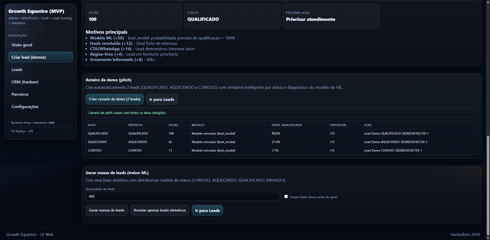

[](#indice)

##### 8.2.2.4 Como interpretar os resultados da guia (regra geral)
- `Score 0-39`: tendência de **CURIOSO**.
- `Score 40-69`: tendência de **AQUECENDO**.
- `Score 70-100`: tendência de **QUALIFICADO** (respeitando regras de qualificação do CRM).
- `Próxima ação`: orientação operacional imediata.
- `Motivos principais`: explicação dos fatores que puxaram score para cima/baixo.
- `Diagnóstico de ML`: transparência de motor, modelo e probabilidade.
- Se houver mensagem de reaproveitamento de lead existente, a UI evitou duplicidade e atualizou score sem repetir eventos.

[](#indice)

#### 8.2.3 Leads (Node.js)
Consulta rápida, filtros e ações de score, edição, exclusão e handoff.
Inclui janela com 20 registros visíveis e barra de rolagem vertical para percorrer os demais registros sem perder o contexto da tela.
Também inclui barra de ações posicionada acima da busca para operação rápida (recarregar, exportar CSV filtrado, exclusão em lote e atalho para CRM), com layout ajustado para não interferir na leitura dos detalhes.

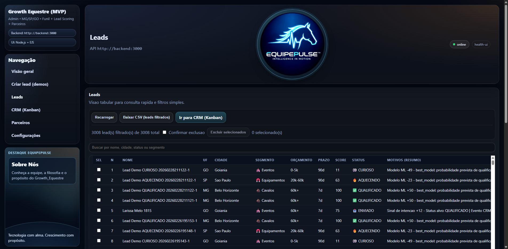

Evidencias de rolagem vertical da pagina (topo da guia -> bloco inferior de Acoes e Diagnostico):

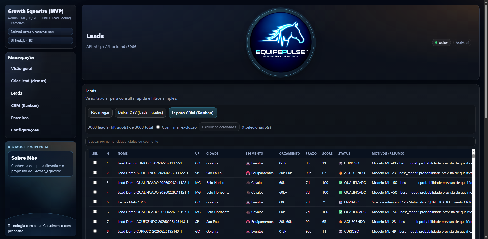
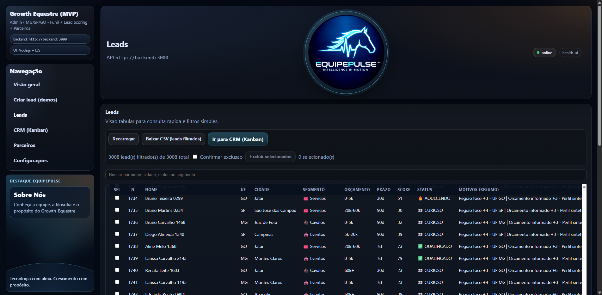

Como interpretar o conteudo inferior da guia (Acoes e Diagnostico):
- **Selecionar lead para acoes**: define o registro alvo para operar sem ambiguidade.
- **Detalhes do lead**: mostra cadastro consolidado (dados de contato, segmento, score, status, motor/modelo e probabilidade).
- **Explicacao do score**: lista fatores e impactos para justificar prioridade comercial.
- **Acoes**: executa fluxo operacional (`Calcular/Atualizar score`, edicao, exclusao e `Handoff` para `ENVIADO`).
- **Avisos e KPIs de acao**: confirmam resultado da ultima operacao e ajudam na validacao rapida do estado do lead.

[](#indice)

<a id="824-guia-detalhado-crm-kanban"></a>

#### 8.2.4 CRM (Kanban) (Node.js) - guia detalhado (o cérebro da aplicação)
Esta é a tela central de operação: concentra priorização, avanço de etapa, automação por evento, acompanhamento pós-envio e leitura gerencial.

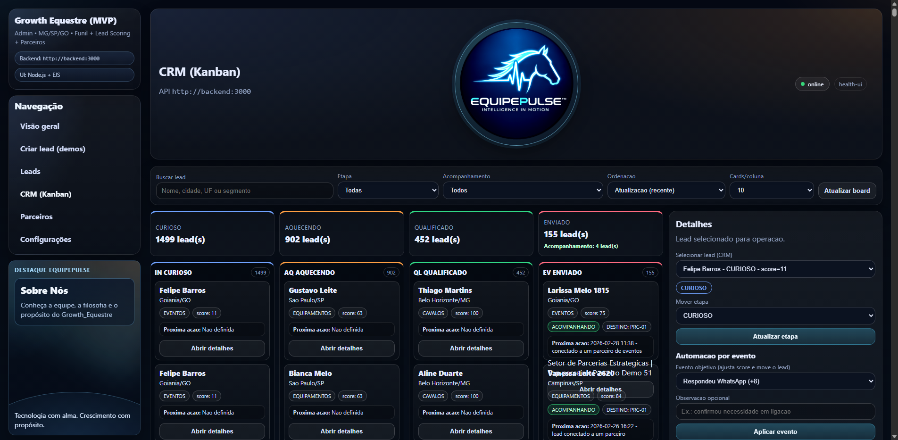

Evidencias de rolagem vertical na operacao do board (cards + painel Detalhes):

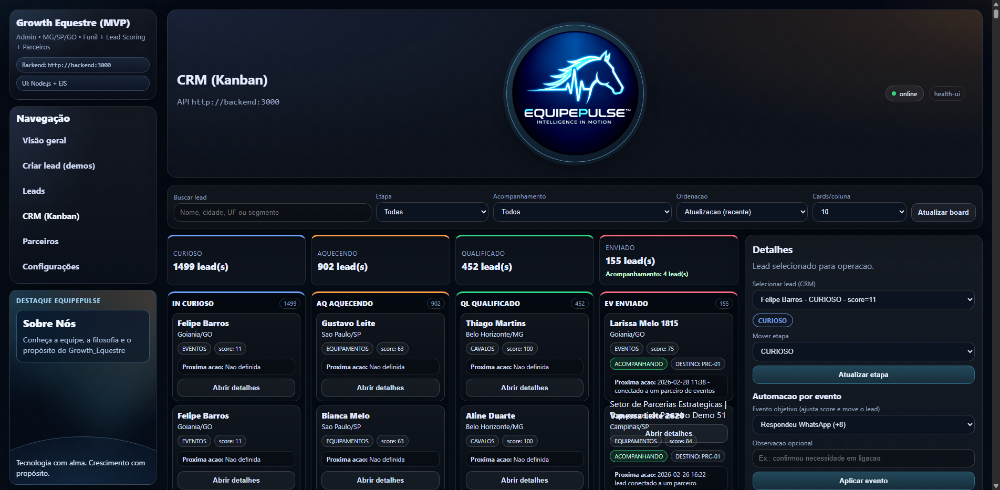
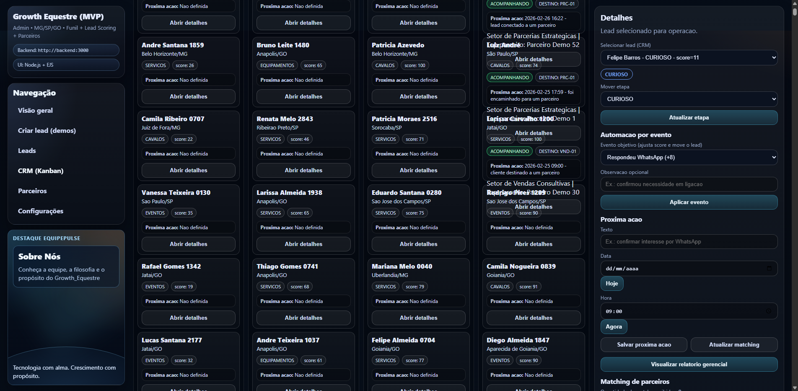

##### Como ler o board em menos de 1 minuto
| Área | O que mostra | Como usar no dia a dia |
|---|---|---|
| **KPIs por coluna** | Volume por etapa (`CURIOSO`, `AQUECENDO`, `QUALIFICADO`, `ENVIADO`) e indicador de acompanhamento em `ENVIADO`. | Comece por aqui para entender gargalo do funil antes de atuar em casos individuais. |
| **Cards por coluna** | Nome, localização, segmento, score, próxima ação e chips de acompanhamento/destino quando aplicável. | Selecione o lead com maior urgência comercial (score + contexto + prazo). |
| **Barra de filtros** | Busca, etapa, acompanhamento (`enviado em acompanhamento`/`sem acompanhamento`), ordenação e cards por coluna. | Use para montar fila operacional por objetivo (nutrição, qualificação, pós-envio). |
| **Painel Detalhes** | Controles de mudança de etapa, evento objetivo, próxima ação, relatório gerencial e matching. | Execute ações com rastreabilidade e retorno imediato de transição. |

##### Regras operacionais oficiais da etapa CRM
- Faixas de score por estágio:
  - `CURIOSO`: `0-39` (coluna `INBOX` no motor interno).
  - `AQUECENDO`: `40-69`.
  - `QUALIFICADO`: `70-100`.
- Gate obrigatório para `QUALIFICADO`: `budget_confirmed + timeline_confirmed + need_confirmed`.
- Se faltar sinal obrigatório, o lead pode ter score alto, mas permanece em `AQUECENDO`.
- `ENVIADO` representa handoff comercial e mantém consistência de score/etapa para operação.
- Movimentação manual (`Atualizar etapa`) ajusta score para a faixa da coluna de destino, mantendo coerência visual e de regra.

##### Operação no painel Detalhes (passo a passo)
1. Clique em `Abrir detalhes` no card desejado.
2. Se necessário, ajuste `Mover etapa` e confirme em `Atualizar etapa`.
3. Em **Automação por evento**, selecione o evento objetivo e clique `Aplicar evento`.
4. Leia a mensagem de retorno:
   - transição de etapa (origem -> destino),
   - variação de score,
   - pendências do gate de qualificação (quando existirem).
5. Em **Próxima ação**, salve texto, data e hora.
6. Para leads em `ENVIADO`, use `texto + data` para marcar como **ACOMPANHANDO**.
7. Ajuste **Matching de parceiros** por quantidade (`1-50`) e prioridade para planejar encaminhamento.

##### Quando usar cada função-chave
- **Atualizar etapa**: quando houve decisão comercial manual validada pelo time.
- **Aplicar evento**: quando um fato objetivo aconteceu (ex.: confirmou orçamento, sem resposta 7 dias, enviou documentos).
- **Salvar próxima ação**: para garantir disciplina de acompanhamento e evitar lead `ENVIADO` sem dono/data.
- **Visualizar relatório gerencial**: para justificar decisão a coordenação, vendas ou parceiros com evidência estruturada.

##### Relatório gerencial (cérebro da aplicação)
Este é o artefato mais importante da solução para tomada de decisão.

**Print da tela do relatório gerencial**

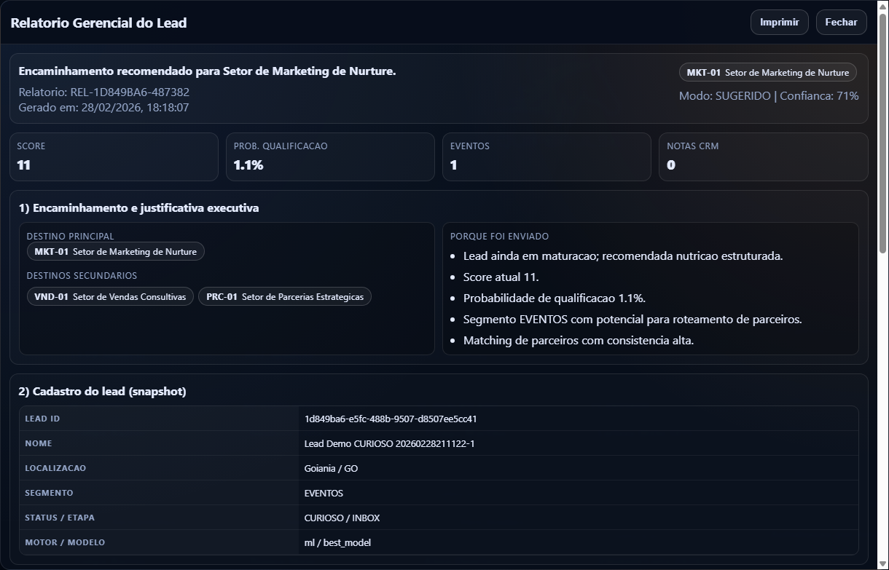

**Loop curto (visão executiva do relatório)**

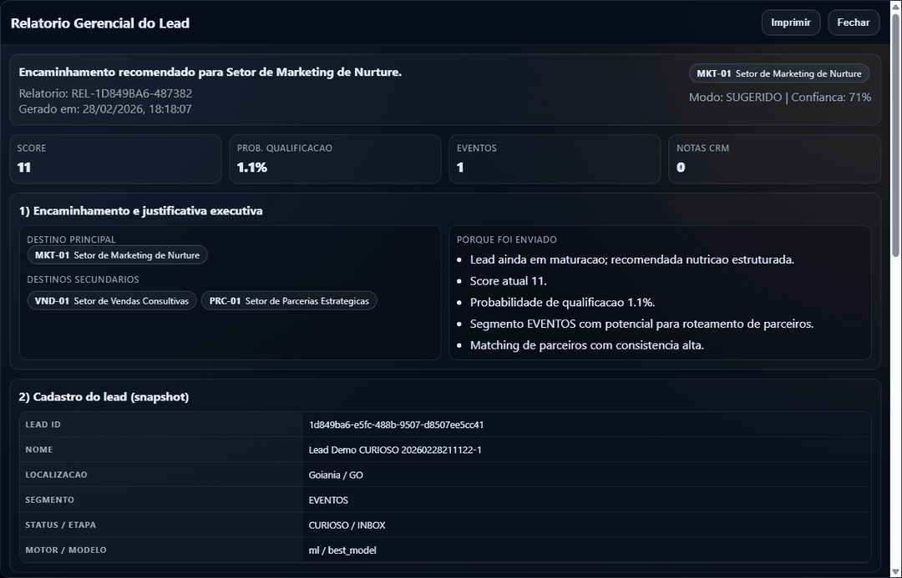

No relatório, o usuário final interpreta 6 blocos principais:
1. **Resumo executivo**: destino recomendado/confirmado do lead e confiança da decisão.
2. **Roteamento**: setor principal, setores secundários e justificativas de encaminhamento.
3. **Inteligência de qualificação**: score, probabilidade, engine/modelo e fatores explicativos.
4. **Engajamento e histórico CRM**: eventos, notas e linha do tempo operacional.
5. **Matching e plano de ação**: parceiros aderentes e próximos passos por janela de tempo.
6. **Riscos e governança**: alertas de operação e rastreabilidade das fontes.

[](#indice)

#### 8.2.5 Parceiros (Node.js)
Busca, filtros e consistência de dados para matching e exportação CSV.
Também inclui:
- coluna **Ordem** à esquerda do CNPJ;
- janela com 20 registros visíveis e rolagem vertical;
- painel **Detalhes do parceiro** com os mesmos campos principais da UI Streamlit (informações principais, contato e endereço);
- campo **Selecionar parceiro** com ordem no label e busca direta por número da ordem via botão **Procurar**;
- botão **Limpar** para limpar simultaneamente **Selecionar parceiro** e **Procurar por ordem**.

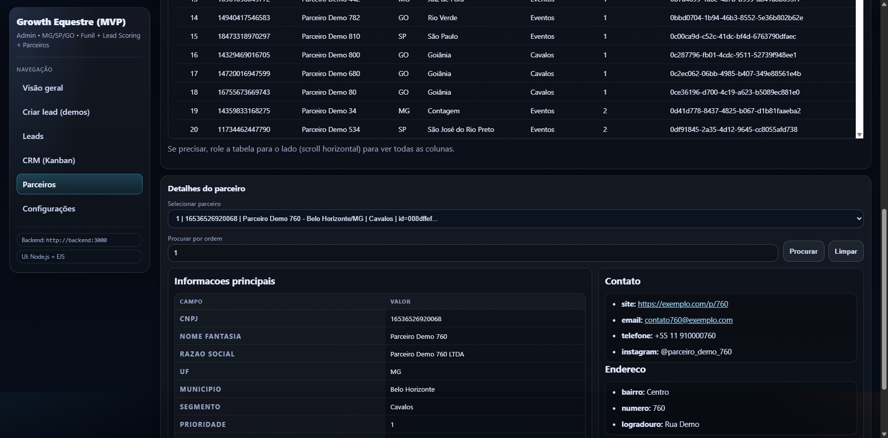

[](#indice)

<a id="826-guia-detalhado-configuracoes"></a>

#### 8.2.6 Configurações (Node.js) - guia detalhado
Guia operacional para manutenção de base e atualização controlada do modelo em produção.

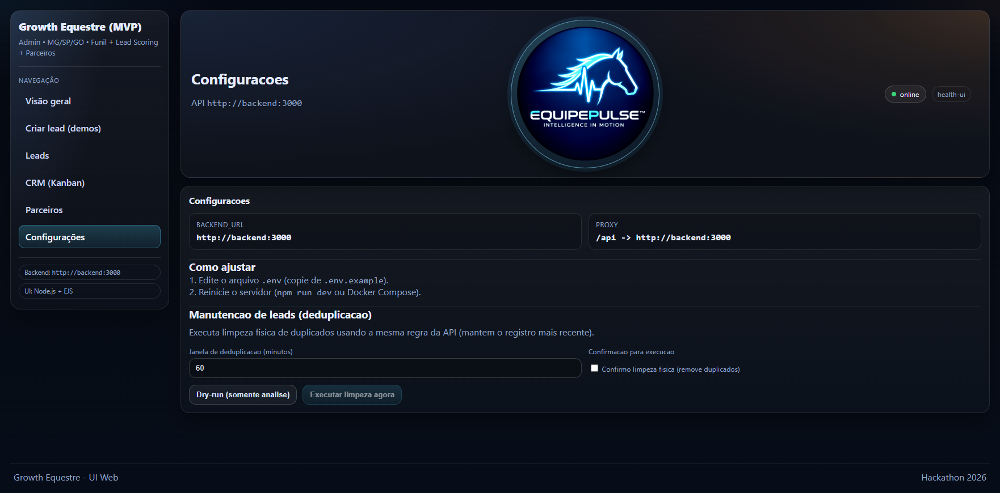

[](#indice)

##### O que o usuário consegue configurar nesta tela
| Bloco | Finalidade | Resultado esperado |
|---|---|---|
| **Manutenção de leads (deduplicação)** | Identificar/remover duplicados mantendo o registro mais recente. | Base mais limpa para operação e treino. |
| **Treinamento do modelo em produção** | Retreinar com a base atual de leads. | Novo modelo passa a valer para **novos scores**. |
| **Random seed do treino** | Controlar reprodutibilidade do treino. | Mais consistência entre execuções quando a base é semelhante. |

##### 8.2.6.1 Manutenção de leads (deduplicação) - como operar
1. Defina `Janela de deduplicação (minutos)` conforme sua regra operacional.
2. Rode `Dry-run (somente análise)` primeiro.
3. Interprete os principais indicadores:
   - `Grupos duplicados`, `Linhas para excluir`, `Leads antes/depois`,
   - migração de `events`, `lead_notes` e estado CRM.
4. Se o diagnóstico estiver correto, marque confirmação e clique `Executar limpeza agora`.

##### 8.2.6.2 Treinamento do modelo em produção - como operar
1. Preencha `Leads esperados na base` (opcional, recomendado para controle).
2. Defina `Random seed do treino` (ex.: `42` para reprodutibilidade padrão).
3. Escolha `Modo de treino`:
   - `Rápido (recomendado)`: menor tempo, adequado para rotina.
   - `Completo`: busca mais extensa, usado em janelas de revisão.
4. Se necessário, marque `Ignorar diferença entre total esperado e total atual`.
5. Marque confirmação e clique `Re-treinar modelo com base atual`.

##### 8.2.6.3 Como interpretar o retorno do retreinamento
- **Modelo vencedor / Runner-up**: comparação final da seleção.
- **Leads usados no treino**: volume efetivamente consumido.
- **Classe QUALIFICADO+ENVIADO vs CURIOSO+AQUECENDO**: balanço de classes do dataset.
- **Razão qualificados**: percentual de classe positiva para monitorar viés de base.
- **Aplicação**: confirma que o novo modelo afeta apenas **novos scores**.
- **Tempo total e relatório salvo em**: rastreabilidade técnica da execução.

##### 8.2.6.4 Boas práticas para usuário final
- Sempre execute deduplicação em `dry-run` antes da limpeza real.
- Evite retreinar em horário de pico operacional.
- Mantenha histórico das seeds usadas nos treinos oficiais (auditoria e repetibilidade).
- Após retreinar, valide em uma amostra de leads novos antes de escalar uso comercial.

##### 8.2.6.5 Exemplo real de saída (após clicar em "Re-treinar modelo com base atual")
Print da própria guia **Configurações** com o retorno exibido na UI:

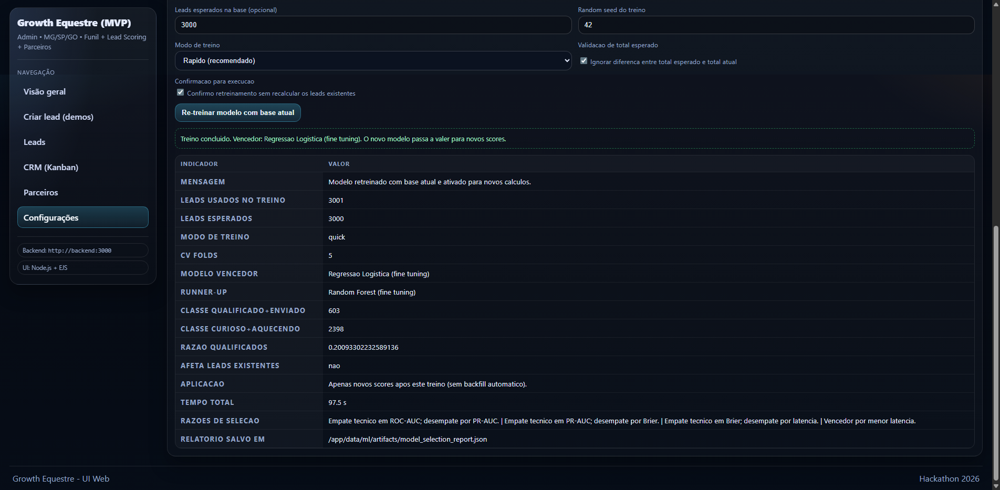

Como o usuário final deve interpretar cada bloco do resultado:
- **Mensagem / aviso verde**: confirma se o treino concluiu e qual modelo venceu.
- **Leads usados no treino**: total realmente aproveitado no dataset.
- **Leads esperados**: parâmetro de controle informado pelo usuário.
- **Modo de treino / CV folds**: estratégia de busca (`quick` ou `full`) e validação.
- **Modelo vencedor / Runner-up**: ranking final dos modelos avaliados.
- **Classe QUALIFICADO+ENVIADO / CURIOSO+AQUECENDO**: distribuição das classes para leitura de equilíbrio da base.
- **Razão qualificados**: percentual da classe de maior intenção comercial.
- **Afeta leads existentes**: deve aparecer `não` para indicar ausência de recálculo retroativo automático.
- **Aplicação**: esclarece que o novo modelo vale para novos scores após o treino.
- **Tempo total**: duração do processo para planejamento operacional.
- **Razões de seleção**: explicação técnica resumida do desempate do modelo vencedor.
- **Relatório salvo em**: caminho do artefato para auditoria e rastreabilidade.

[](#indice)

<a id="827-guia-detalhado-sobre-nos"></a>

#### 8.2.7 Sobre Nós (Node.js) - guia detalhado
Esta guia consolida a identidade do produto, proposta de valor e composição do time em formato orientado ao usuário final.

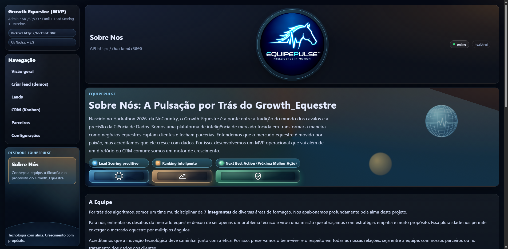

Como interpretar os blocos da guia:
- **Hero principal**: posiciona o propósito do Growth_Equestre e a mensagem central do produto.
- **Nossa Missão**: explica o objetivo operacional (reduzir adivinhação comercial) e como a plataforma converte dados em decisão prática.
- **Nossos Pilares de Tecnologia**: detalha os três pilares de ML (Lead Scoring, Ranking de Parceiros e Next Best Action) com leitura objetiva para negócio.
- **A Equipe**: apresenta os integrantes e reforça a visão multidisciplinar por trás da solução.
- **Compromisso com valores humanos**: explicita o alinhamento entre tecnologia, ética, qualidade de vida e governança de dados.

Quando usar essa guia no dia a dia:
1. **Onboarding de usuário**: para contextualizar rapidamente objetivo, escopo e capacidade da plataforma.
2. **Apresentações e pitch**: para alinhar narrativa de produto com evidências visuais da UI.
3. **Governança interna**: para reforçar o princípio de uso responsável de dados e operação com propósito.

[](#indice)

---

<a id="9-como-a-solucao-apoia-a-tomada-de-decisao"></a>

## 9. Como a Solução Apoia a Tomada de Decisão

[](#indice)
O sistema transforma dados operacionais em decisão comercial:

1. **Priorização de atendimento**
   - score e status indicam quem deve ser atendido primeiro.
2. **Risco de perda menor**
   - handoff marca lead `ENVIADO` quando está pronto para tratamento comercial.
3. **Aderência de oferta**
   - matching conecta lead ao parceiro mais alinhado por contexto.
4. **Visão executiva em tempo real**
   - KPIs consolidados na visão geral.
5. **Confiabilidade**
   - deduplicação e exclusão em lote evitam distorção operacional.
6. **Rastreabilidade gerencial no CRM**
   - relatório gerencial detalha destino do lead, motivação do encaminhamento, riscos e plano de ação.

---

## 10. Motor de Machine Learning (Dual Models)

[](#indice)
### 10.1 Notebook principal
- `tools/ml/lead_scoring_caminho1_dual_models.ipynb`

### 10.2 Script de treino reprodutível
- `tools/ml/train_lead_scoring.py`

### 10.3 Modelos avaliados
- Regressão Logística (fine tuning)
- Random Forest (fine tuning)

### 10.4 Critério de desempate
Comparação por cascata:
1. ROC-AUC
2. PR-AUC
3. Brier score
4. Latência de inferência

### 10.5 Artefatos gerados
- `data/ml/artifacts/lead_scoring_best_model.joblib`
- `data/ml/artifacts/lead_scoring_runner_up_model.joblib`
- `data/ml/artifacts/model_selection_report.json`

### 10.6 Retreino rápido
```powershell
python tools/ml/train_lead_scoring.py --input-csv data/ml/lead_scoring_dataset.csv --output-dir data/ml/artifacts
```

Depois do retreino, reinicie o serviço de scoring:
```powershell
docker compose up -d --build scoring
```

---

## 11. Fluxo de Dados e Endpoints Principais

[](#indice)
| Endpoint | Método | Uso |
|---|---|---|
| `/leads` | `GET` | Lista leads |
| `/leads` | `POST` | Cria lead |
| `/leads/:id/score` | `POST` | Calcula score do lead |
| `/leads/bulk-delete` | `POST` | Exclusão em lote |
| `/crm/board` | `GET` | Dados do Kanban |
| `/crm/move` | `POST` | Move lead no Kanban |
| `/crm/event-rules` | `GET` | Lista regras objetivas de automação por evento no CRM |
| `/crm/leads/:id/apply-rule` | `POST` | Aplica evento objetivo (delta de score + atualização de status/etapa) |
| `/crm/leads/:id/matches` | `GET` | Matching de parceiros |
| `/crm/leads/:id/managerial-report` | `GET` | Relatório gerencial completo do lead (setor destino, justificativas, score, histórico, riscos e plano de ação) |
| `/crm/leads/:id/relatorio-gerencial` | `GET` | Alias em PT-BR para o relatório gerencial |
| `/leads/:id/managerial-report` | `GET` | Rota de compatibilidade sem prefixo `/crm` |
| `/partners` | `GET` | Lista parceiros |
| `/partners/summary` | `GET` | Resumo por segmento/UF |
| `/ml/model-info` | `GET` | Modelo vencedor e fine tuning |
| `/demo/seed-leads` | `POST` | Gera massa sintética (treino/demo) |
| `/demo/reset-seeded-leads` | `POST` | Remove apenas leads sintéticos |

---

## 12. Estrutura de Pastas

[](#indice)
```text
.
|- backend/                    # API Node/Express
|- scoring_service/            # FastAPI para score
|- ui_web/                     # UI Node.js + EJS
|- ui_admin/                   # UI Streamlit
|- tools/ml/                   # Notebook e scripts de treino
|- data/ml/                    # Dataset e artefatos ML
|- db/init.sql                 # Schema inicial Postgres
|- docs/                       # Materiais técnicos e planos
|- manuais_and_docs/           # Manuais finais para operação
|- docker-compose.yml          # Orquestração completa
|- start_and_validate.ps1      # Bootstrap + validação (Windows)
```

---

## 13. Troubleshooting

[](#indice)
### 13.1 Porta 3100 recusando conexão
```powershell
docker compose ps
docker compose logs ui_web --tail 100
```

### 13.2 Verificar se backend está no ar
```powershell
Invoke-WebRequest http://localhost:3000/health | Select-Object -ExpandProperty Content
```

### 13.3 Rebuild completo
```powershell
docker compose down
docker compose up -d --build
```

### 13.4 Ver portas ocupadas no Windows
```powershell
netstat -ano | findstr :3000
netstat -ano | findstr :3100
netstat -ano | findstr :8501
```

---

<a id="14-branches-e-estrategia-de-trabalho"></a>

## 14. Branches e Estratégia de Trabalho

[](#indice)
Convenção adotada:
- `feature/fe` -> entregas da UI Node.js
- `feature/be` -> entregas da UI Streamlit/operação admin
- `feature/ds` -> pipeline de dados e ML
- `main` -> consolidação estável

Recomendação:
- abrir PR separado por frente;
- revisar diff por domínio antes de merge.

---

<a id="15-documentacao-complementar"></a>

## 15. Documentação Complementar

[](#indice)
Materiais completos (PT-BR e Espanhol) em:
- `docs/resolução_desafio_growth_equestre/`
- `manuais_and_docs/`

Inclui:
- plano de resolução do desafio;
- guia de uso das interfaces;
- manual de setup no Windows/VS Code;
- documento técnico da solução de Data Science.

Complemento atualizado da automação CRM (evento -> score/status/etapa):
- `manuais_and_docs/Growth_Equestre_MVP_Guia_Uso_PT-BR_ATUALIZACAO_CRM_EVENTOS_2026-02-18.md`
- `manuais_and_docs/README.md`

---

<a id="16-3-questoes-de-lgpd-uso-pratico-na-operacao"></a>

## 16. 3 Questoes de LGPD (uso pratico na operacao)

[](#indice)

Esta secao consolida as 3 perguntas de LGPD que devem guiar a operacao diaria do produto.

### 16.1 Questao 1 - Qual a base legal para coletar e tratar os dados do lead?
Pergunta pratica:
- Estamos tratando somente os dados necessarios para a finalidade comercial declarada?

Diretriz:
- Definir base legal antes da coleta (ex.: consentimento, execucao de contrato ou legitimo interesse, conforme o caso).
- Registrar finalidade de uso de cada dado coletado (nome, contato, cidade, segmento, historico de eventos).
- Aplicar principio de minimizacao: nao coletar dado sem necessidade operacional clara.

Como interpretar na operacao:
- Se um campo nao influencia atendimento, score, handoff ou auditoria, ele deve ser revisto.
- A coleta precisa ser transparente ao titular (o lead deve entender para que os dados serao usados).

### 16.2 Questao 2 - Como compartilhar dados com parceiros sem violar LGPD?
Pergunta pratica:
- Quais dados realmente precisam ser compartilhados no handoff para o parceiro executar a acao comercial?

Diretriz:
- Compartilhar apenas o minimo necessario para execucao do atendimento.
- Garantir que o parceiro use os dados apenas para a finalidade definida.
- Manter rastreabilidade de envio (quem enviou, quando enviou, para qual parceiro e por qual motivo).

Como interpretar na operacao:
- O status `ENVIADO` deve representar handoff controlado e justificavel.
- Dados sensiveis ou excessivos nao devem ser repassados sem necessidade e sem base legal.

### 16.3 Questao 3 - Como atender os direitos do titular (acesso, correcao e exclusao)?
Pergunta pratica:
- Se o titular solicitar acesso, correcao ou eliminacao dos dados, o time consegue responder com prazo e evidencia?

Diretriz:
- Manter fluxo operacional para localizar rapidamente o lead e seu historico.
- Permitir correcao de cadastro e exclusao quando cabivel, com registro da acao realizada.
- Definir politica de retencao e descarte para nao manter dado por tempo indefinido.

Como interpretar na operacao:
- O sistema precisa sustentar resposta auditavel para solicitacoes do titular.
- Governanca de dados nao e opcional: ela reduz risco juridico e melhora confiabilidade da operacao.

---

<a id="17-licenca-e-uso"></a>

## 17. Licença e Uso

[](#indice)
Projeto acadêmico/hackathon com foco demonstrativo.

Se for evoluir para produção, recomenda-se:
- hardening de segurança;
- observabilidade centralizada;
- autenticação/autorização;
- governança de dados e LGPD.

---

<a id="18-colaboradores"></a>

## 18. Colaboradores

[](#indice)

Colaboradores autorizados no GitHub deste repositorio:

- [@brodyandre](https://github.com/brodyandre) - Luiz Andre de Souza
- [@aluizr](https://github.com/aluizr) - AndreRibeiro
- [@Eduardo-Marchi2025](https://github.com/Eduardo-Marchi2025) - Eduardo Marchi
- [@emanuelssergio](https://github.com/emanuelssergio) - Emanuel Silva Sergio
- [@everton754](https://github.com/everton754) - Everton Santos
- [@Laisallz](https://github.com/Laisallz) - Lisane Lucia Zanatta
- [@giacomo1960](https://github.com/giacomo1960) - Giacomo Villa
